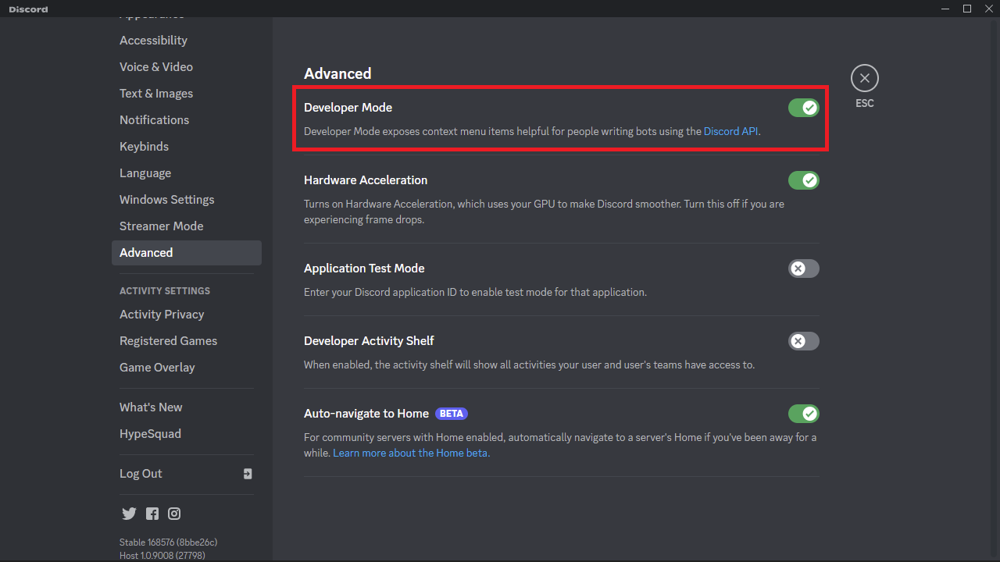

# Discord Bot Template

A simple discord bot template for the [bohr.io](https://bohr.io) platform. It uses API endpoints to respond to Interactions with the bot.

## Setting your project

1. In the [bohr.io](https://bohr.io) platform start a new project with this template.

2. Create a [Discord application](https://discord.com/developers/applications) and a bot.

3. Generate a url in the OAuth2/Url Generator, with the options:
    - `SCOPES`:
        - `applications.commands`
        - `bot`

        <p align="center"></p>

    - `BOT PERMISSIONS`:
        - `Use Slash Commands`
        - `Send Messages`

        <p align="center"></p>

4. Invite the bot to your server using the generated url.

5. Set the following environment variables on the [bohr.io](https://bohr.io) project settings:

    - From your Discord Application General Information page:
        - `APPLICATION_ID`
        - `DISCORD_PUBLIC_KEY`

        <p align="center"></p>

    - From your Discord Application Bot page.
        - `DISCORD_BOT_TOKEN`

        <p align="center"></p>

    - From your Discord Client (enable the 'developer mode' under advanced settings. Then right click on your test server)
        - `TEST_GUILD_ID`

        <p align="center">
        
        
        </p>

    6. In the discord application General Information, set the `INTERACTIONS ENDPOINT URL` with the project's interactions api endpoint: `https://<PROJECT_URL>/api/interactions`

        <p align="center"></p>

## Developing

1. Create a second Discord application to be your development application.
2. Start the project locally using the terminal commands:

    ```
    git clone <PROJECT_REPOSITORY_URL>
    cd <REPOSITORY_NAME>
    npx -y bohr@latest dev
    ```

3. When starting your project locally, a tunnel url to your local project will be provided. Use it for the `INTERACTIONS ENDPOINT URL` in the development application.

<p align="center"></p>

</br>

## Updating Commands

To update the bot commands use the project's endpoint `/update-commands`.

This endpoint can receive the `global` query parameter. When set to `'true'`, it updates global bot commands. Otherwise, it only updates commands for the `TEST_GUILD_ID` server.

## Commands

 - server: send the channel and server that the user is in
 - user: send a mention to the user
